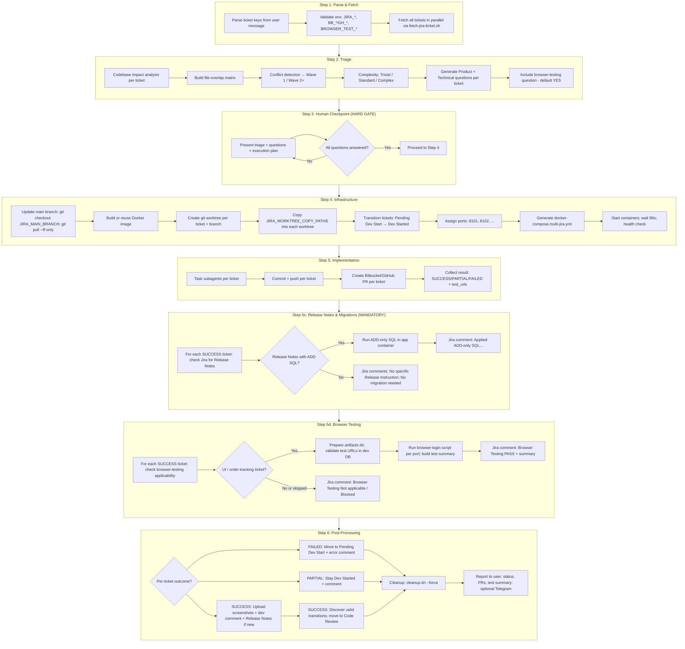

# jira-swarms Workflow Diagram

```mermaid
flowchart TB
    subgraph STEP1["Step 1: Parse & Fetch"]
        A1[Parse ticket keys from user message]
        A2[Validate env: JIRA_*, BB_*/GH_*, BROWSER_TEST_*]
        A3[Fetch all tickets in parallel via fetch-jira-ticket.sh]
        A1 --> A2 --> A3
    end

    subgraph STEP2["Step 2: Triage"]
        B1[Codebase impact analysis per ticket]
        B2[Build file-overlap matrix]
        B3[Conflict detection → Wave 1 / Wave 2+]
        B4[Complexity: Trivial / Standard / Complex]
        B5[Generate Product + Technical questions per ticket]
        B6[Include browser-testing question - default YES]
        B1 --> B2 --> B3 --> B4 --> B5 --> B6
    end

    subgraph STEP3["Step 3: Human Checkpoint (HARD GATE)"]
        C1[Present triage + questions + execution plan]
        C2{All questions answered?}
        C1 --> C2
        C2 -->|No| C1
        C2 -->|Yes| C3[Proceed to Step 4]
    end

    subgraph STEP4["Step 4: Infrastructure"]
        D1[Update main branch: git checkout JIRA_MAIN_BRANCH; git pull --ff-only]
        D2[Build or reuse Docker image]
        D3[Create git worktree per ticket + branch]
        D4[Copy JIRA_WORKTREE_COPY_PATHS into each worktree]
        D5[Transition tickets: Pending Dev Start → Dev Started]
        D6[Assign ports: 8101, 8102, ...]
        D7[Generate docker-compose.multi-jira.yml]
        D8[Start containers; wait 90s; health check]
        D1 --> D2 --> D3 --> D4 --> D5 --> D6 --> D7 --> D8
    end

    subgraph STEP5["Step 5: Implementation"]
        E1[Task subagents per ticket]
        E2[Commit + push per ticket]
        E3[Create Bitbucket/GitHub PR per ticket]
        E4[Collect result: SUCCESS/PARTIAL/FAILED + test_urls]
        E1 --> E2 --> E3 --> E4
    end

    subgraph STEP5c["Step 5c: Release Notes & Migrations (MANDATORY)"]
        F1[For each SUCCESS ticket: check Jira for Release Notes]
        F2{Release Notes with ADD SQL?}
        F3[Run ADD-only SQL in app container]
        F4[Jira comment: Applied ADD-only SQL...]
        F5[Jira comments: No specific Release Instruction; No migration needed]
        F1 --> F2
        F2 -->|Yes| F3 --> F4
        F2 -->|No| F5
    end

    subgraph STEP5d["Step 5d: Browser Testing"]
        G1[For each SUCCESS ticket: check browser-testing applicability]
        G2{UI / order-tracking ticket?}
        G3[Prepare artifacts dir; validate test URLs in dev DB]
        G4[Run browser-login script per port; build test summary]
        G5[Jira comment: Browser Testing PASS + summary]
        G6[Jira comment: Browser Testing Not applicable / Blocked]
        G1 --> G2
        G2 -->|Yes| G3 --> G4 --> G5
        G2 -->|No or skipped| G6
    end

    subgraph STEP6["Step 6: Post-Processing"]
        H1{Per-ticket outcome?}
        H2[FAILED: Move to Pending Dev Start + error comment]
        H3[PARTIAL: Stay Dev Started + comment]
        H4[SUCCESS: Upload screenshots + dev comment + Release Notes if new]
        H5[SUCCESS: Discover valid transitions; move to Code Review]
        H6[Cleanup: cleanup.sh --force]
        H7[Report to user: status, PRs, test summary; optional Telegram]
        H1 --> H2
        H1 --> H3
        H1 --> H4 --> H5
        H2 --> H6
        H3 --> H6
        H5 --> H6 --> H7
    end

    STEP1 --> STEP2 --> STEP3 --> STEP4 --> STEP5 --> STEP5c --> STEP5d --> STEP6
```
